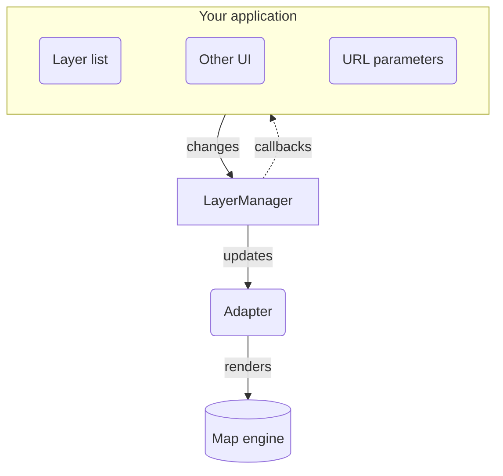

# Getting started

Universal Layer Manager is designed to give you a single, predictable place to manage layers in web map applications. It coordinates what exists on your map, how layers are grouped, which ones are showing, their opacity, and their drawing order.

Because layer state lives in its own manager outside your UI components, it is not trapped inside a single layer list widget. Changes can come from user interactions (like toggling a switch or clicking a feature) or programmatically (like reading URL parameters or responding to API events).

## Concepts

Mapping libraries and UI toolkits often use words like "active", "visible", and "selected" interchangeably. Universal Layer Manager uses a few specific terms to keep behaviour consistent across different map engines.

### Layers

A layer is a single piece of content on your map. It often corresponds directly to a layer in your map library (such as a Leaflet tile layer or GeoJSON source), but it does not have to. You can also create synthetic layers. For example, splitting unique values in a roads dataset into separate toggleable layers for each road type, and then allowing users to toggle them on and off.

### Layer groups

A layer group is an ordered collection of layers. Groups can sit at the root level or be nested inside other groups to form a tree. They exist purely in the manager to structure your layer logic, so your map library does not need native grouping support for this to work.

### The layer manager

The layer manager (`LayerManager`) is the central store for your entire layer tree. Every operation—adding layers, reordering them, toggling visibility, or adjusting opacity—goes through the manager. It computes the resulting state and notifies listeners.

### Switched on vs showing

A common source of confusion in nested layer lists is whether a layer is switched on (`enabled`) or actually showing on the map (`visible`):

+ **`enabled`** reflects whether the switch for that layer or group is flipped on in your UI.
+ **`visible`** reflects whether the layer is actually rendered on the map.

::: tip The visibility cascade
We have taken an opinionated approach: when a user switches on a layer, it should become visible. A layer only shows if it is enabled *and* every group above it is enabled, so switching on a layer also switches on every group above it. See [Showing a layer](./visibility-and-opacity#showing-a-layer).
:::

### Opacity and computed opacity

Just like visibility, opacity cascades down through groups. A layer has its own opacity setting (from `0` to `1`), but its final **computed opacity** on the map is multiplied by the opacity of all its ancestor groups. Fading out a group smoothly fades out everything inside it.

### Bottom-to-top order

Web map engines (including Leaflet, MapLibre, and HTML5 Canvas) draw content from the bottom of the map up to the top. Universal Layer Manager keeps all internal ordering in this same **bottom-to-top** order.

i.e. items with a higher index in the position array are drawn on top of items with a lower index.

::: tip Displaying the layer list
When you build a UI layer list, you will typically display this list in reverse, so that the topmost visual layer appears at the top of your menu.
:::

### Layer data

Alongside identifiers and visibility flags, each layer can carry your own custom data in `layerData`. This gives your application one clean place to attach map layer instances, legends, attribution, or API endpoints. For example, you might attach a note to a layer to show in your layer list.

### Adapters

An adapter connects the manager to your chosen map engine, translating state updates into map calls. We provide adapters for [Leaflet](./adapters/leaflet), [MapLibre](./adapters/maplibre) and [ArcGIS](./adapters/arcgis), and it is straightforward to [write your own](./adapters/writing-an-adapter) for libraries like OpenLayers.

### State machines

Under the hood, each layer and group is an [XState](https://stately.ai/docs/xstate) state machine. A layer is always in one of a few states, such as switched off, visible, or switched on but hidden, and events move it from one state to the next. This keeps the behaviour predictable and easy to test.

You don't need to know XState to use the library. To learn more, see Stately's introduction to [state machines and statecharts](https://stately.ai/docs/state-machines-and-statecharts), or [work with the underlying state machines directly](./xstate).

## Workflow

This diagram visualises how data and events flow between your application, the layer manager, and the map engine.

